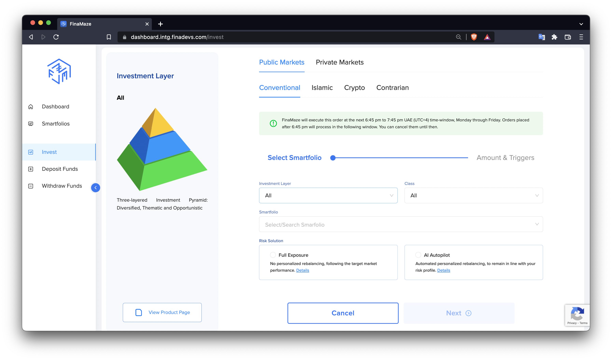
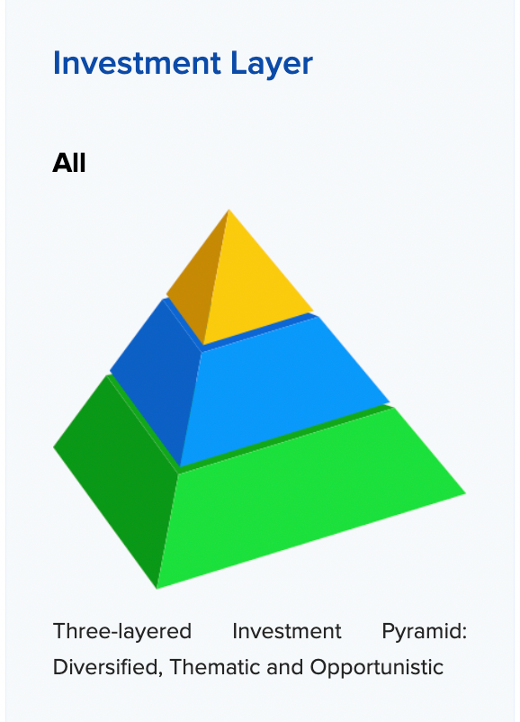

# INVEST PROCESS DOCUMENTATION

## Overview

### Investment Layers

The Investment Pyramid consists of 3 layers:

1. Diversified: low-risk smartfolios which should represent the largest portion of your assets.
2. Opportinistic: Alpha strategies meant to seize momentary and "risky" market opportunities. Should represent a smaller allocation.
3. Thematic: Diversified smartfolios but only within your selected asset class, region or sector. Should represent a reasonable allocation.
